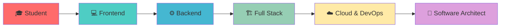

<div align="center">

# Hola soy Miguel Angel  </h1>

[](https://git.io/typing-svg)


</div>

---

## 🚀 Sobre Mí


**🎓 Estudiante de Ingeniería de Sistemas** en la Universidad Nacional de Trujillo  
**📍 7mo Ciclo** | **🇵🇪 Trujillo, Perú**

Soy un desarrollador apasionado que vive y respira código. Mi misión es transformar ideas complejas en soluciones digitales elegantes y escalables. Con **2 años** desarrollando con tecnologías modernas.

### 💡 **Mi Logica**
```javascript
const developer = {
    name: "Miguel Angel",
    passion: "Aprender , crecer y avanzar",
    mission: "Construir soluciones escalables",
    currentFocus: "ERPS y Desarrollo de Software",
    futureGoal: "Software Architect"
}
```

**🔥 Lo que me impulsa:**
- 🎯 Crear impacto tanto en mi entorno como en el exterior
- 🧩 Resolver problemas complejos con soluciones legibles 
- 📈 Construir aplicaciones que escalen y perduren
- 🤝 Colaborar con equipos talentosos
- 🌱 Aprender algo nuevo cada día

<br clear="right"/>

---

## ⚡ Stack Tecnológico

<div align="center">

### 🎨 **Frontend Development**


### ⚙️ **Backend Development**


### 🗄️ **Database & Cloud**


### 🛠️ **DevOps & Tools**


## 📊 GitHub Analytics

<div align="center">


## 💼 Experiencia & Skills

<div align="center">

### 🎯 **Especialidades Adicionales**

<table>
<tr>
<td align="center" width="25%">
<br>
<strong>Database Design</strong><br>
</td>
<td align="center" width="25%">
<br>
<strong>Cloud Computing</strong><br>
</td>
</tr>
</table>

</div>

---

## 🌟 Fun Facts


 🌙 **Pensador Nocturno:** Se codifica mejor en la noche <br>
 🎮 **Gamer:** Juego en tiempo libre <br>
 📚 **Amante de los Libros:** Leo libros por pasion<br>
 🎵 **Musica:** Escucho musica mientras codifico<br>
 🌮 **Comida:** Especialista en encontrar la mejor comida de Trujillo<br>
 🐾 **Pet Lover:** Me encantan los animales!<br>

<br clear="left"/>

---

## 📈 Learning Journey



---

## 🤝 Conectemos!

<div align="center">


### 🌐 **Contactame**

[](https://www.linkedin.com/in/miguel-cabanillas-257205308)
[](mailto:mcabanillasurbina@gmail.com)
[](https://github.com/miguelangep1p)

### 💬 **Una charla interesante no se le niega a nadie**
🚀 **Proyectos innovadores** • 💼 **Oportunidades laborales** • 🤝 **Colaboraciones**  
📚 **Mentorías** • 🎯 **Tecnologías emergentes** • ☕ **Café y código**

---


### 💡 *"Codificar es traducir el caos del pensamiento en el orden de la lógica; es hablar con las máquinas para entender mejor a los humanos."*

**¿Tienes una idea genial? ¡Hablemos y hagámosla realidad!** 🚀

</div>
