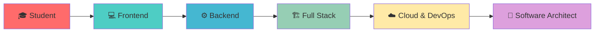

<div align="center">

# 👨‍💻 Miguel Angel

[](https://git.io/typing-svg)


[](https://linkedin.com/in/tu-perfil)
[](https://tu-portfolio.com)
[](mailto:tu-email@gmail.com)


</div>

---

## 🚀 Sobre Mí


**🎓 Estudiante de Ingeniería de Sistemas** en la Universidad Nacional de Trujillo  
**📍 7mo Ciclo** | **🇵🇪 Trujillo, Perú**

Soy un desarrollador apasionado que vive y respira código. Mi misión es transformar ideas complejas en soluciones digitales elegantes y escalables. Con más de **3 años** desarrollando con **Laravel** y tecnologías modernas.

### 💡 **Mi Philosophy**
```javascript
const developer = {
    name: "Miguel Angel",
    passion: "Solving complex problems",
    mission: "Building scalable solutions",
    currentFocus: "Enterprise Laravel Applications",
    futureGoal: "Software Architect"
}
```

**🔥 Lo que me impulsa:**
- 🎯 Crear impacto real a través de la tecnología
- 🧩 Resolver problemas complejos con soluciones elegantes  
- 📈 Construir aplicaciones que escalen y perduren
- 🤝 Colaborar con equipos talentosos
- 🌱 Aprender algo nuevo cada día

<br clear="right"/>

---

## ⚡ Stack Tecnológico

<div align="center">

### 🎨 **Frontend Development**


### ⚙️ **Backend Development**


### 🗄️ **Database & Cloud**


### 🛠️ **DevOps & Tools**


</div>

---

## 🏆 Proyectos Destacados

<div align="center">

<table>
<tr>
<td width="50%">

### 🏢 **Sistema ERP Empresarial**


**Stack:** Laravel 11 • MySQL • Vue.js • Redis

🎯 **Impact:** +10K transacciones diarias  
📊 **Módulos:** Inventario, Facturación, RRHH  
⚡ **Performance:** 99.9% uptime  

```php
// Clean Architecture Implementation
class ERPController extends Controller 
{
    public function dashboard(): JsonResponse
    {
        return $this->businessService
            ->getMetrics()
            ->toApiResponse();
    }
}
```

</td>
<td width="50%">

### 🛒 **E-commerce Platform**


**Stack:** React • Node.js • MongoDB • Stripe

🚀 **Features:** Pagos en tiempo real  
📱 **Mobile:** Progressive Web App  
🔒 **Security:** JWT + OAuth2  

```javascript
// Modern React Hooks
const usePayment = () => {
  const [loading, setLoading] = useState(false)
  
  const processPayment = async (amount) => {
    setLoading(true)
    // Payment logic here
  }
  
  return { processPayment, loading }
}
```

</td>
</tr>
</table>

### 📱 **App Universitaria UNT**


**Stack:** Angular • Spring Boot • PostgreSQL • Docker

**Features destacadas:**
- 📚 Gestión académica completa
- 📊 Analytics en tiempo real  
- 🔔 Notificaciones push
- 📱 Aplicación móvil híbrida

</div>

---

## 📊 GitHub Analytics

<div align="center">


</div>

---

## 🎯 Current Status


### 📚 **Formación Académica**
**Universidad Nacional de Trujillo**  
🎓 *Ingeniería de Sistemas* • 7mo Ciclo  
📅 *2021 - 2025*

### 🔥 **Currently Working On**
```typescript
const currentProjects = {
  🏢 enterprise: "Laravel ERP System v2.0",
  📚 learning: "AWS Solutions Architect",
  📖 reading: "Domain-Driven Design",
  🎯 goal: "Senior Full Stack Developer"
}
```

### 🏅 **Logros Recientes**
- ✅ **Laravel Expert** - 15+ aplicaciones en producción
- ✅ **Team Lead** - Liderando equipo de 4 developers  
- ✅ **Mentor** - 20+ estudiantes guiados
- ✅ **Speaker** - Tech talks en la universidad

<br clear="right"/>

---

## 💼 Experiencia & Skills

<div align="center">

### 🎯 **Especialidades**

<table>
<tr>
<td align="center" width="25%">
<br>
<strong>Laravel Expert</strong><br>
<em>3+ años</em>
</td>
<td align="center" width="25%">
<br>
<strong>React Developer</strong><br>
<em>2+ años</em>
</td>
<td align="center" width="25%">
<br>
<strong>Database Design</strong><br>
<em>4+ años</em>
</td>
<td align="center" width="25%">
<br>
<strong>Cloud Computing</strong><br>
<em>1+ año</em>
</td>
</tr>
</table>

</div>

---

## 🌟 Fun Facts


- 🌙 **Night Owl:** Mis mejores códigos salen después de las 10 PM
- ☕ **Coffee Addict:** 4+ tazas de café al día (mínimo)
- 🎮 **Gamer:** Counter-Strike y Valorant en tiempo libre
- 📚 **Bookworm:** Leo 1 libro técnico al mes
- 🎵 **Music:** Lofi hip hop mientras codifico
- 🌮 **Foodie:** Especialista en encontrar la mejor comida de Trujillo

<br clear="left"/>

---

## 📈 Learning Journey



---

## 🤝 Let's Connect!

<div align="center">


### 🌐 **Find Me Online**

[](https://linkedin.com/in/tu-perfil)
[](https://tu-portfolio.com)
[](mailto:tu-email@gmail.com)
[](https://github.com/tu-usuario)

### 💬 **Let's Talk About**
🚀 **Proyectos innovadores** • 💼 **Oportunidades laborales** • 🤝 **Colaboraciones**  
📚 **Mentorías** • 🎯 **Tecnologías emergentes** • ☕ **Café y código**

---


### 💡 *"Code is not just my profession, it's my passion"*

**¿Tienes una idea genial? ¡Hablemos y hagámosla realidad!** 🚀

</div>
